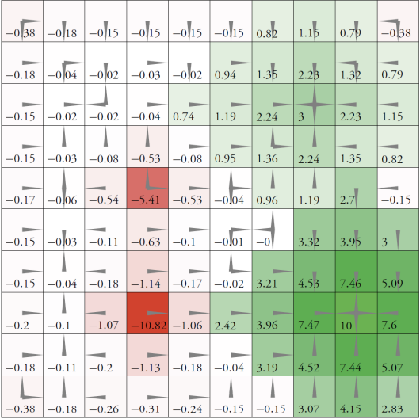
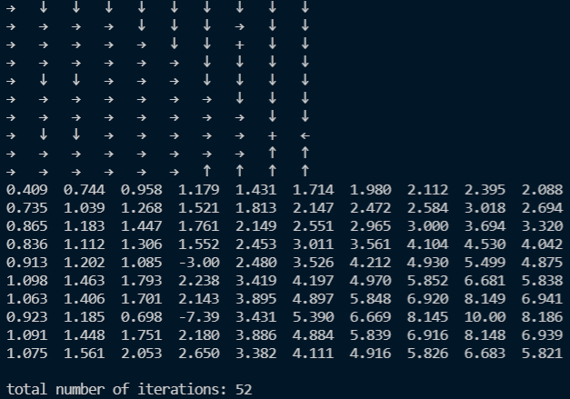

# Dynamic programming for MDPs

**Value iteration, Gauss-Seidel iteration** and **policy iteration** in a 10x10 grid world problem in *Decision Making Under Uncertainty - Theory and Application*.

> Each cell in the grid represents a state in an MDP. The available actions are up, down, left, and right. The effects of these actions are stochastic. We move one step in the specified direction with probability 0.7, and we move one step in one of the three other directions, each with probability 0.1. If we bump against the outer border of the grid, then we do not move at all. We receive a cost of 1 for bumping against the outer border of the grid. There are four cells in which we receive rewards upon entering: (8, 9) has a reward of +10, (3, 8) has a reward of +3, (5, 4) has a reward of −5, (8, 4) has a reward of −10

The number in each cell is max{R(*s*,*a*)} where *s* is the state the cell represents and *a* is any available action in *s*.

## Results

Run `value_iter.py, Gauss_Seidel.py, policy_iter.py` to get the results of **value iteration, Gauss-Seidel iteration** and **policy iteration**. (The figure below is the result of value iteration)

